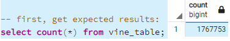

# Amazon_Vine_Analysis

Analysis of Amazon reviews written by members and non-member of the paid Amazon Vine program

## Overview/Purpose:

This analysis is to determine if there is any bias toward favorable reviews from Vine members in Amazon reviews. I chose to work with the jewelry review data at:
(https://s3.amazonaws.com/amazon-reviews-pds/tsv/amazon_reviews_us_Jewelry_v1_00.tsv.gz)

Note: All reviews are at https://s3.amazonaws.com/amazon-reviews-pds/tsv/index.txt.

## ETL steps followed:

#### 1)	Create AWS RDS:

#### RDS Endpoint Captured for PostgreSQL Server Creation:

#### 2)	Create PostgreSQL Server (using AWS endpoint):

#### 3)	Tables created in PostgreSQL:

#### 4)	Run ETL steps (**Amazon_Reviews_ETL.ipynb**) to load the tables

- Here are the records loaded for the vine table:

#### 5)	Create tables needed to do analysis from vine table:

- Here we select only records having total votes greater than or equal to total votes:
  

- Here we capture only the votes that were found ‘most helpful’:
  

- At this point we get the count of records we will be using to do the anaylsis:

- Here are the number of members:

- Here are the number of non-members:

*** The same processing was completed for the ‘five star’ part of analysis.

## Results:

I created a table containing all the results. Here is the processing for the results.

Here is the results table)

The table does answer the following questions: 

-	How many Vine reviews and non-Vine reviews were there?
-	How many Vine reviews were 5 stars? How many non-Vine reviews were 5 stars?
-	What percentage of Vine reviews were 5 stars? What percentage of non-Vine reviews were 5 stars?

### Summary: 
There is no bias found for the jewelry reviews in the Vine program towards members. In the table above we can see the percents between total number of reviews and total number of five star views have similar percents. We could further evaluate the reviews by checking the reviews with only one star. (A member may be more likely to give a bad review.)
